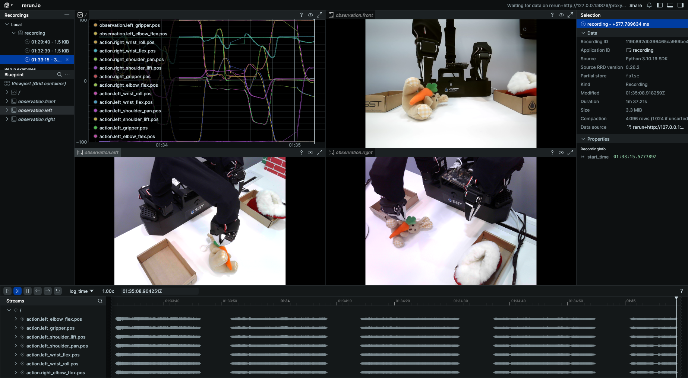

# BI-SO101 Data Collection Guide

A guide for collecting teleoperation data using the BI-SO101 bimanual robot.

---

## 1. Activate Environment

Open a terminal and activate the xlerobot environment.

▶️ **Run**
```bash
conda activate xlerobot
```

## 2. Navigate to Working Directory

▶️ **Run**
```bash
cd sst_xlerobot/lerobot
```

## 3. Connect the Robot

Use two USB hubs and one laptop USB port. **The connection order is important!**

### First USB Hub
Connect in the following order:
1. Follower left arm → `/dev/ttyACM0`
2. Follower right arm → `/dev/ttyACM1`
3. Left camera → `/dev/video2`

### Second USB Hub
Connect in the following order:

1. Leader left arm → `/dev/ttyACM2`
2. Leader right arm → `/dev/ttyACM3`
3. Right camera → `/dev/video4`

### Direct Laptop Connection
- Front camera → `/dev/video6`
### USB Permission Setup

Grant permissions after connecting all cables./home/stream/sst_xlerbot/lerobot/bi_so101_configs/lerobot.png

▶️ **Run**
```bash
chacm0123
```

> **Note**:
> - You don't need to run this after each cable connection. Just run it once after all cables are connected.
> - If any cable gets disconnected, **reconnect all cables in order** and grant permissions again with `chacm`.

## 4. Setup Collection Environment

After positioning the robot and cameras, use teleoperation mode to check the camera views and adjust camera angles.

▶️ **Run**
```bash
cd lerobot && ./bi_so101_configs/run_teleoperate.sh
```

Adjust the angle of each camera (left, right, front) while viewing the camera feeds.



## 5. Modify Configuration File

📁 **Configuration File Path**
```
/home/stream/sst_xlerbot/lerobot/bi_so101_configs/scripts/bi_so101_record.yaml
```

### Required Modifications

Only change the last part of **repo_id** and **root**.

📝 **Example)** Change `qualcomm` → `univ`:
```yaml
dataset:
  repo_id: xhaka3456/univ                                              # Change
  root: /home/stream/sst_xlerbot/lerobot/bi_so101_configs/datasets/univ  # Change
```

| Field | Description |
|-------|-------------|
| `repo_id` | Name used when saving the dataset to Hugging Face Hub |
| `root` | Local path where data will be stored |

### Optional Parameters

📝 **Configuration**
```yaml
dataset:
  episode_time_s: 20    # Recording time per episode (seconds)
  reset_time_s: 1       # Wait time between episodes (seconds)
  num_episodes: 30      # Total number of episodes to record

resume: true            # Whether to continue recording from existing dataset
```

| Parameter | Description |
|-----------|-------------|
| `episode_time_s` | Recording duration per episode (seconds). Set according to time needed to complete the task |
| `reset_time_s` | Wait time after each episode ends before the next one starts (seconds). Time needed to reset the environment |
| `num_episodes` | Total number of episodes to collect |
| `resume` | `true`: Continue recording from existing dataset / `false`: Start fresh. **Only set to `true` if a dataset with the same name already exists** |

## 6. Start Data Collection

**Important**: If the episode time ends before you finish the task, stay still and continue from where you left off in the next episode.

▶️ **Run**
```bash
cd lerobot && ./bi_so101_configs/run_record.sh
```

### If Interrupted (Ctrl+C)

If you press `Ctrl+C` during data collection, the data won't be saved to Hub but **will be saved locally**.

Don't worry! Run the record script again and complete the set number of episodes. All previously unsaved data will be uploaded to Hub together.

### Manual Hub Upload

If for some reason data is only saved locally and not uploaded to Hub, you can upload directly with the following command.

▶️ **Run**
```bash
python3 /home/stream/sst_xlerbot/lerobot/bi_so101_configs/push_dataset.py \
    --repo_id "username/dataset_name" \
    --root "local_dataset_path"
```

📝 **Example**
```bash
python3 /home/stream/sst_xlerbot/lerobot/bi_so101_configs/push_dataset.py \
    --repo_id "xhaka3456/univ" \
    --root "/home/stream/sst_xlerbot/lerobot/bi_so101_configs/datasets/univ"
```

> **Tips for collecting good data** are explained in detail below.

## 7. Wait for Hub Upload

Once data collection is complete for the set number of episodes, it will automatically upload to Hugging Face Hub.

- Duration: Approximately **10 minutes**
- A loading screen will be displayed in the terminal

## 8. Verify Upload

When the terminal loading is complete:

1. Check Hub: Go to https://huggingface.co/xhaka3456
2. Verify that the dataset with your `repo_id` name exists
3. Confirm that the files in the local `root` path match the Hub files

## 9. After Completion

Once you confirm the data is successfully saved to Hub, **contact harvey**.
Harvey will handle the model training.

---

## Tips for Collecting Good Data

### 1. Set Up a Clean Background

Make sure one side of the camera view is always facing a **wall** with no moving objects. Organize the surrounding environment to minimize distractions and visual noise before setting up camera angles.

> **⚠️ IMPORTANT**: Remove any objects that might move or change during data collection from the camera's field of view.

### 2. Break Down Movements into Steps

Don't simply grab the object. Break down the motion into stages.

**Example: Picking Up a Doll Task**
1. Position the robot gripper above the doll
2. Rotate the gripper to a good gripping angle
3. Open the gripper as wide as possible
4. Insert the doll deep into the gripper
5. Close the gripper to grab the doll
6. Place it in the box

Breaking down movements this way leads to better quality data.

### 3. Be Mindful of Lighting Conditions

This model is **highly affected by lighting** since it judges solely based on images.

- Presence or absence of light
- Direction of shadows

The robot's judgment varies based on these factors. While diverse datasets from various environments would solve this, if that's not possible, find a **physical location with minimal variables**.

### 4. Place Objects in Various Positions and Angles

Placing objects in similar positions and angles repeatedly will reduce data diversity.

- ❌ Performance only in specific areas
- ✅ Various positions + various angles = Generalized performance

Change the object's position and angle for each episode during data collection.

---

## Troubleshooting

### Port Permission Error

▶️ **Run**
```bash
chacm
```
